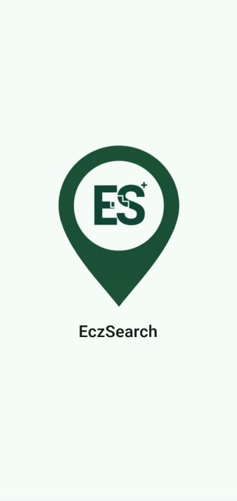
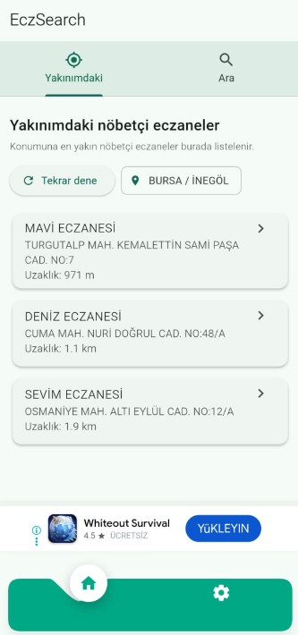
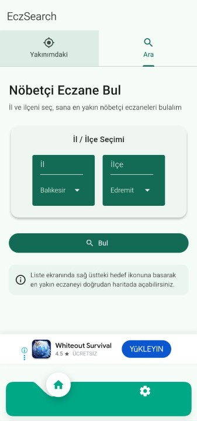
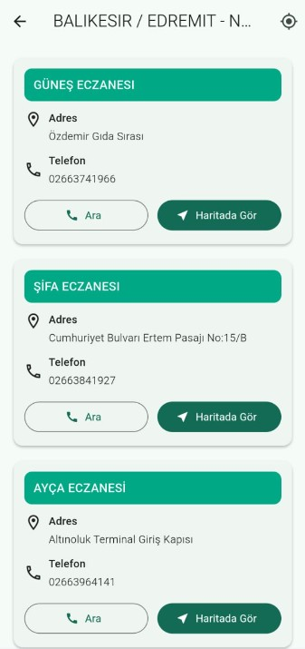
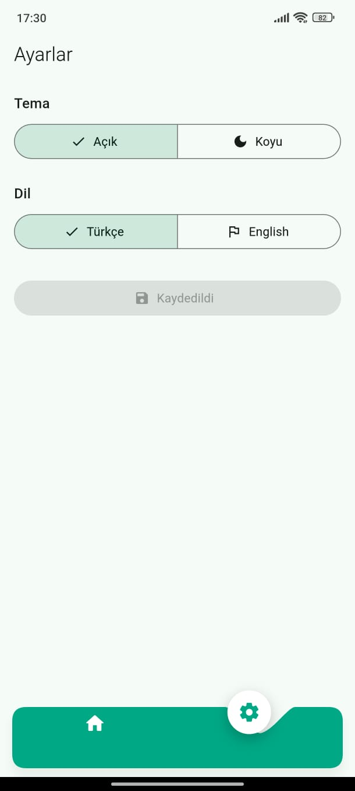

## 📱 Proje Hakkında

**EczSearch**, acil durumlarda insanların en yakın nöbetçi eczaneye en hızlı şekilde ulaşmasını sağlamak amacıyla geliştirdiğim bir mobil uygulamadır.

### 📸 Ekran Görüntüleri

Yan yana 3 ekran görüntüsü:

  
  
  
  
  

Modern arayüzü ve hızlı altyapısı sayesinde, saniyeler içinde konumunuza en yakın açık eczaneyi listeler, yol tarifi almanızı sağlar.

### 🛠️ Kullanılan Teknolojiler

Bu projeyi geliştirirken aşağıdaki teknolojileri kullandım:

* **Flutter & Dart:** Cross-platform mobil geliştirme için.
* **REST API:** Eczane verilerini anlık çekmek için.
* **Google Maps API:** Konum ve harita servisleri için.
* **Figma:** UI/UX tasarımı için.

---

### 🚀 İndirme Bağlantısı

Uygulama şu an **Google Play Store** onay aşamasındadır. Çok yakında yayında olacak!

<button class="bg-primary-600 text-white font-bold py-2 px-4 rounded opacity-50 cursor-not-allowed" disabled>
  🚀 Play Store (Çok Yakında)
</button>